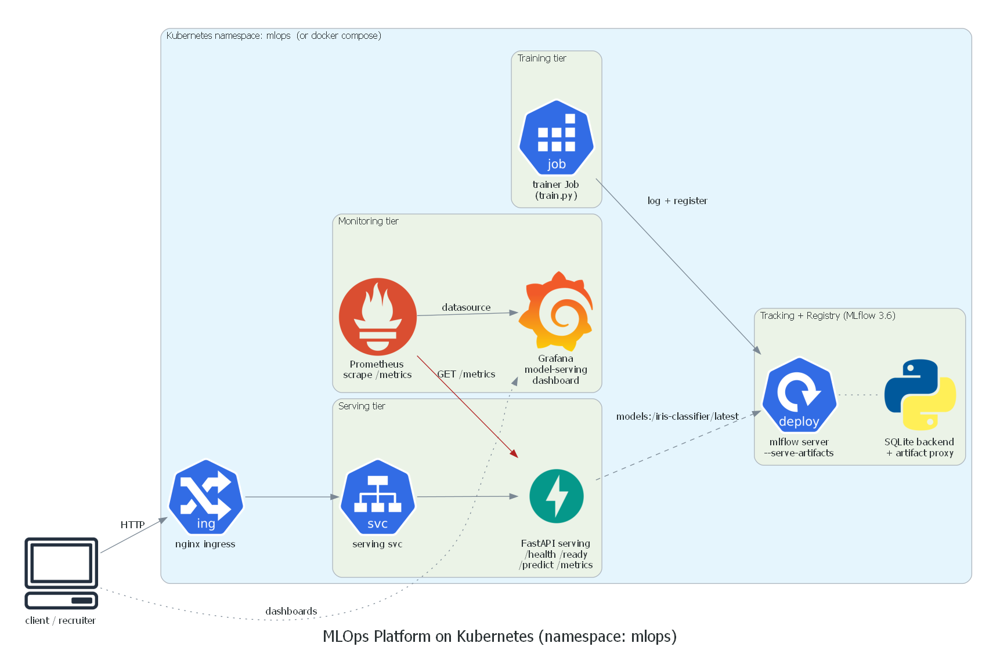
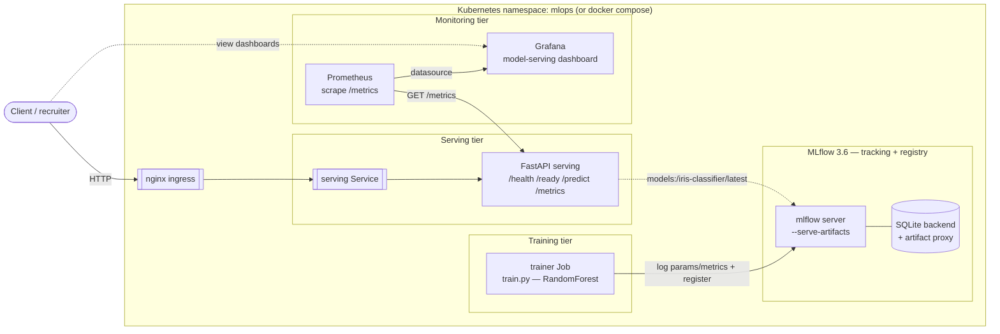
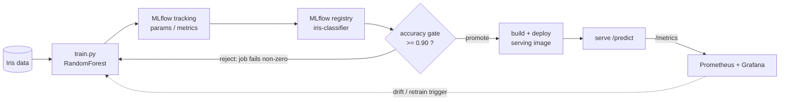
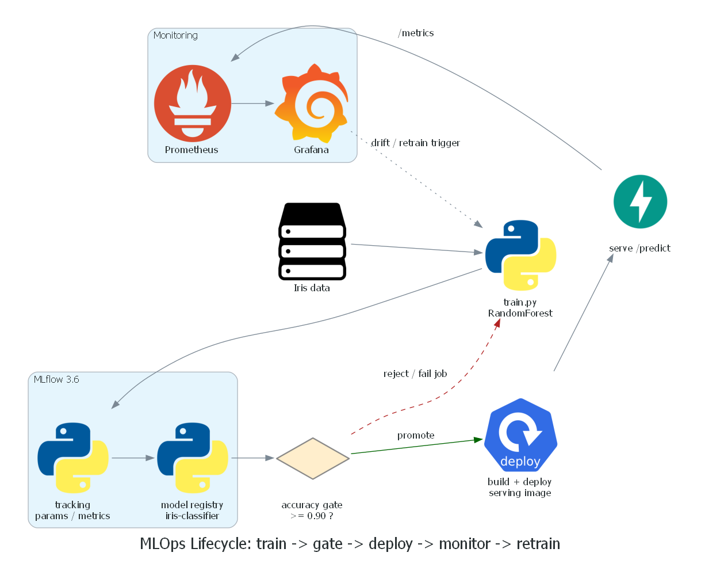
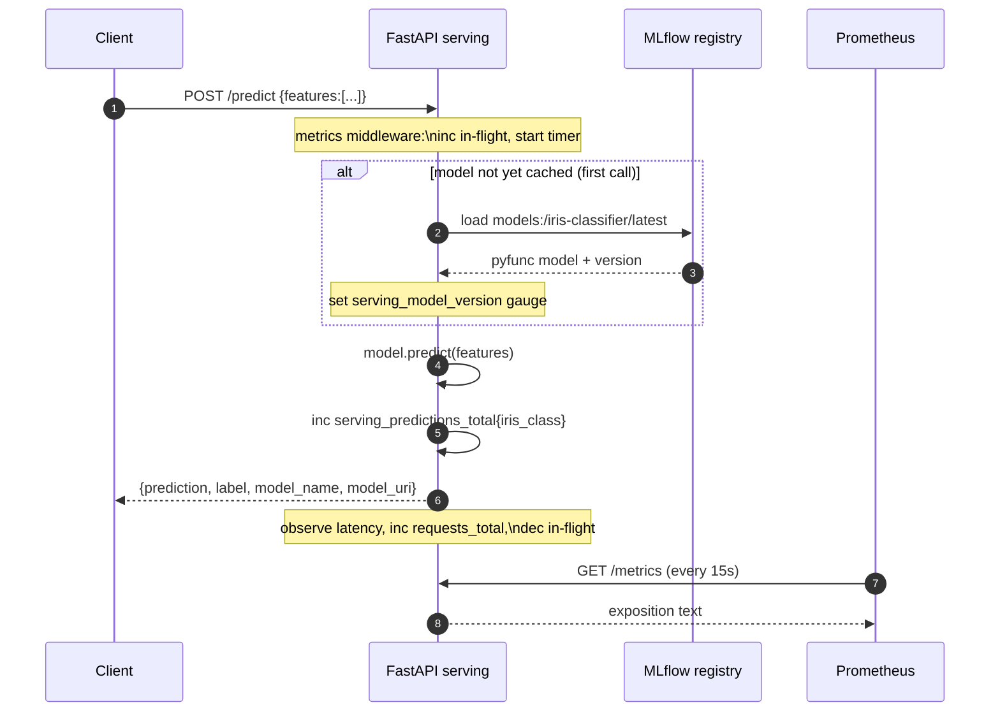
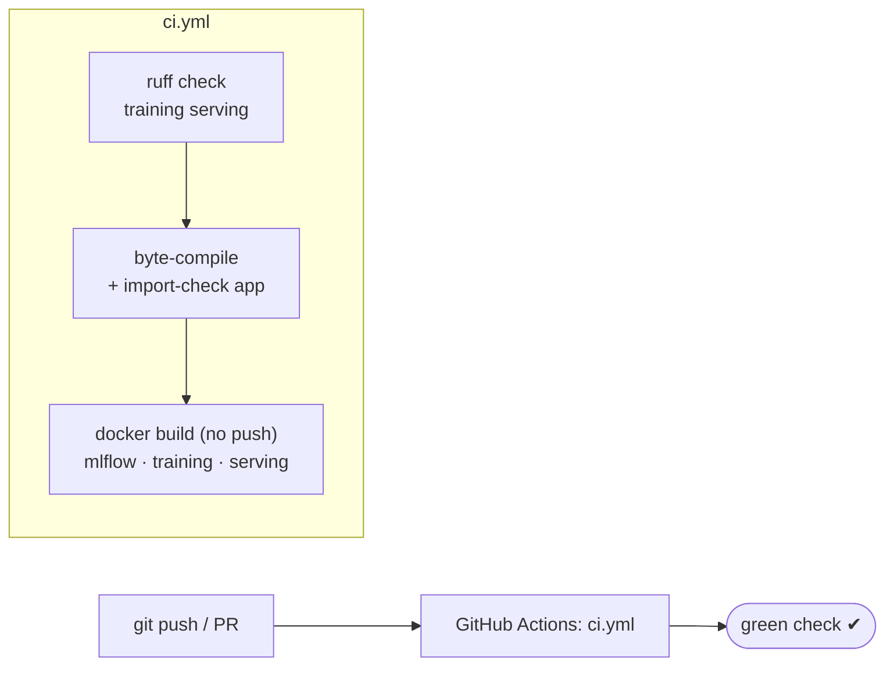

# Architecture deep dive

This document is the visual + narrative deep dive for the MLOps platform. Every
diagram below renders directly on GitHub (Mermaid) and is mirrored by rendered
PNGs generated from `docs/diagrams/*.py` (mingrammer `diagrams`).

- Rendered architecture: [`diagrams/architecture.png`](diagrams/architecture.png)
- Rendered lifecycle: [`diagrams/workflow.png`](diagrams/workflow.png)

---

## 1. Platform architecture

The MLflow Model Registry is the single source of truth: everything served is
resolved by name + version/alias (`models:/iris-classifier/latest`), never from
a loose file.

---

## 2. MLOps lifecycle with the promotion gate

The gate is enforced in `training/train.py`: below `--accuracy-threshold`
(default `0.90`) the job raises `SystemExit`, exiting non-zero so a bad model is
never registered as servable — the same behaviour as a CI/CD model-validation
stage blocking a release.

---

## 3. Prediction request sequence

The model is loaded lazily and cached (thread-safe) on the first request, so
container start stays fast and `/health` responds before a model exists.

---

## 4. CI/CD flow

CI is OSS-only (ruff + Python + Docker Buildx, `push: false`) so it runs green
on a public fork without any secrets or registry credentials.

---

## Serving metrics reference

Exposed at `GET /metrics` (Prometheus text exposition):

| Metric | Type | Labels | Meaning |
|---|---|---|---|
| `serving_requests_total` | counter | `method`, `endpoint`, `http_status` | HTTP requests handled |
| `serving_request_latency_seconds` | histogram | `method`, `endpoint` | Request latency (p50/p95/p99 via `histogram_quantile`) |
| `serving_predictions_total` | counter | `iris_class` | Predictions per predicted iris class |
| `serving_model_version` | gauge | — | Registry version currently loaded |
| `serving_inflight_requests` | gauge | — | Requests currently being processed |
